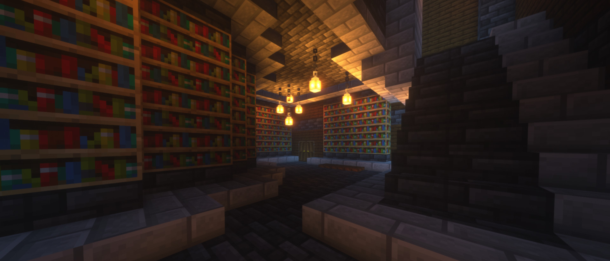

# Minecraft Library of Babel

The custom server source code that hosts the Library of Babel recreated in Minecraft.

An instance of this server is being hosted at: *mclob.doteye.online*

Learn more about the project here: https://doteye.online/projects/mclob

If you're looking for the search tools site source code, head here: https://github.com/DotEye/Minecraft-Library-of-Babel-Tools

### Running Your Own Server
1. Download or clone the repository and open a terminal in the repository root.
2. Install [Node.js](https://nodejs.org/en) and [Yarn](https://yarnpkg.com).
3. Install node dependencies with `yarn`.
4. Start the server with `yarn start`.
